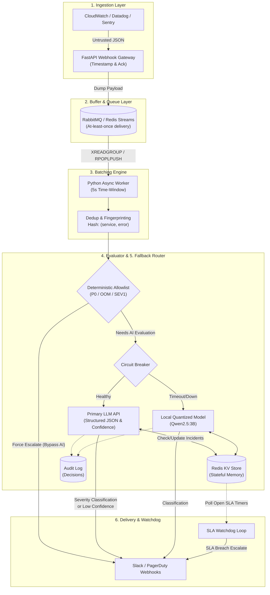

# Incident Command SRE Router - Architecture

Based on the updated `tech_arch.md` that was pulled, here is the visual representation of your robust, decoupled architecture.

### Key Highlights Visualized:
- **Decoupled Architecture**: Notice how the `FastAPI Webhook Gateway` drops data directly into `RabbitMQ / Redis Streams` and returns a 200 OK, completely isolating ingestion traffic from processing latency.
- **The Brain's Safety Net**: Before any LLM is called, the `Deterministic Allowlist` checks for known severe incidents (like P0 or OOM) and force-escalates them immediately.
- **Circuit Breaker Pattern**: If the primary LLM API times out, the `Circuit Breaker` catches it and routes the batch to the `Local Quantized Model` to ensure smart routing even offline.
- **The SLA Watchdog**: Operating completely independently of the AI inference, the `Watchdog` constantly polls the Redis state store to escalate any incidents that breach SLA timeframes.
