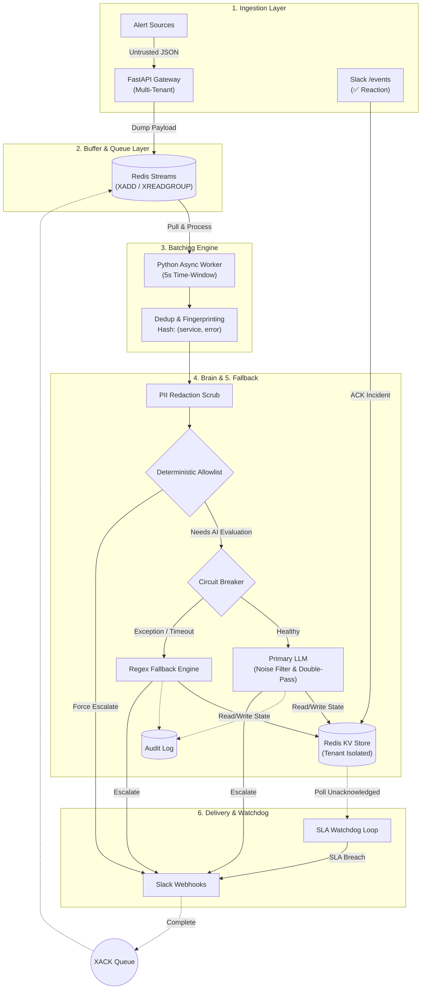

# Incident Command SRE Router - Architecture

Based on the updated `tech_arch.md` that was pulled, here is the visual representation of your robust, decoupled architecture.

### Key Highlights Visualized:
- **Interactive ACK Loop**: The `Delivery API` sends the alert to Slack, and if an engineer reacts with a ✅, the `Slack /events` webhook receives it and acknowledges the incident in Redis—stopping the `SLA Watchdog` from paging the next person.
- **Robust Queueing**: The pipeline leverages `Redis Streams`. Messages are consumed via `XREADGROUP` and only marked as complete (`XACK`) after the LLM or Fallback engine successfully processes them, ensuring true crash-safety.
- **The Brain's Safety Nets**: Before any LLM is called, data is passed through `PII Redaction`, and then the `Deterministic Allowlist` checks for known severe incidents (like P0 or OOM) to force-escalate them immediately.
- **Circuit Breaker Pattern**: If the primary LLM API times out, the `Circuit Breaker` catches it and routes the batch to a `Regex Fallback Engine` to guarantee alerts are never dropped.
